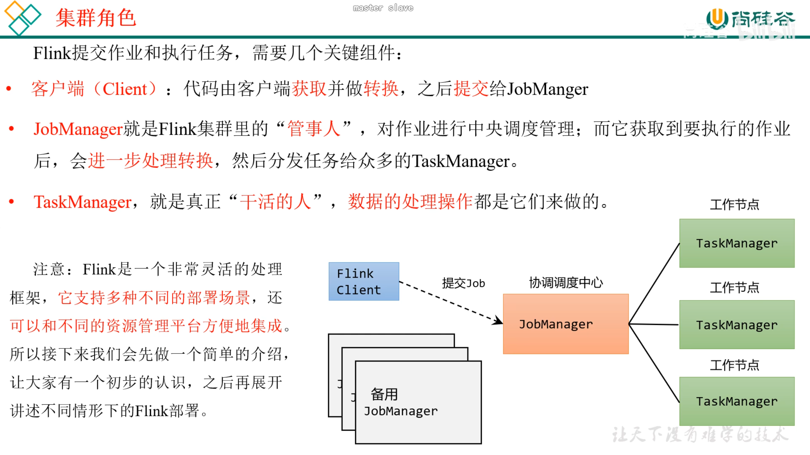

<!-- TOC -->
* [Linux](#linux)
* [Hadoop集群](#hadoop集群)
  * [Hadoop 2.2以上, 并由HDFS服务](#hadoop-22以上-并由hdfs服务)
  * [1. 环境变量](#1-环境变量)
* [Docker](#docker)
  * [docker常用命令](#docker常用命令)
  * [DOCKERFILE 文件编译docker镜像](#dockerfile-文件编译docker镜像)
* [FLink](#flink)
  * [Flink2.2官方文档](#flink22官方文档)
<!-- TOC -->
# Linux
```linux
// 查看内存信息
lscpu是Linux下最常用的CPU信息查询工具，能够显示详细的CPU架构、核心数、线程数等信息。

// 更换yum镜像源
1、备份原始的源文件
cd /etc/yum.repos.d/
mv CentOS-Base.repo CentOS-Base.repo.blk
2、 下载阿里云的源文件
wget -O /etc/yum.repos.d/CentOS-Base.repo https://mirrors.aliyun.com/repo/Centos-7.repo
curl -o /etc/yum.repos.d/CentOS-Base.repo https://mirrors.aliyun.com/repo/Centos-7.repo
3、清理缓存
yum clean all
4、加载新的源(阿里云)
yum makecache

// 批量下载常用软件
yum -y vim dnf

// 安装ing
mkdir /pkgs
mkdir -p /opt/huaiwei/
touch /etc/profile.d/huaiwei_env.sh

cd /opt/huaiwei/
tar -zxf /pkgs/jdk-8u202-linux-x64.tar.gz -C ./
tar -zxf /pkgs/hadoop-3.4.2.tar.gz -C ./
tar -zxf /pkgs/apache-hive-4.2.0-bin.tar.gz -C ./
tar -zxf /pkgs/kafka_2.13-4.1.1.tgz -C ./
tar -zxf /pkgs/flink-1.17.0-bin-scala_2.12.gz -C ./

mv /opt/huaiwei/jdk1.8.0_202 /opt/huaiwei/jdk180
mv /opt/huaiwei/hadoop-3.4.2/ /opt/huaiwei/hadoop342
mv /opt/huaiwei/apache-hive-4.2.0-bin/ /opt/huaiwei/hive420


vim /etc/profile.d/huaiwei_env.sh
# JAVA_HOME
export JAVA_HOME=/opt/huaiwei/jdk180
export PATH=$JAVA_HOME/bin:$PATH

# HADOOP_HOME
export HADOOP_HOME=/opt/huaiwei/hadoop342
export HADOOP_COMMON_HOME=$HADOOP_HOME
export HADOOP_HDFS_HOME=$HADOOP_HOME
export HADOOP_MAPRED_HOME=$HADOOP_HOME
export HADOOP_YARN_HOME=$HADOOP_HOME
export PATH=$HADOOP_HOME/bin:$HADOOP_HOME/sbin:$PATH


```

# Hadoop集群


## Hadoop 2.2以上, 并由HDFS服务
## 1. 环境变量
sudo vim /etc/profile.d/my_env.sh

HADOOP_HOME=/opt/huaiwei/hadoop-3.3.4
export PATH=$PATH:$HADOOP_HOME/bin:$HADOOP_HOME/sbin
export HADOOP_CONF_DIR=${HADOOP_HOME}/etc/hadoop
export HADOOP_CLASSPATH=`hadoop classpath`

# Docker
## docker常用命令
<BR>https://www.bilibili.com/video/BV1MC4y1P7GE?spm_id_from=333.788.player.switch&vd_source=fa7bdbb85b3026e2a92e276472cd8bc7
<BR>// run :: docker启动命令 -i :: 交互 -t :: 终端 -bash :: docker终端； 每个docker都有自己唯一的containerId, 重复输入docker run命令只会生成新容器
<BR><B>docker run -it \<dockerContainerId>/\<dockerName>:\<dockerTag> bash</B>
<BR>// -p \<dockerHostPort>:\<dockerContainerPort> :: 启动时设置docker端口映射dockerPort Mapping Function
<BR><B>docker run -p \<dockerHostPort>:\<dockerContainerPort> \<dockerName>:\<dockerTag></B>
<BR>// -e \<valName>=\<valValue> :: 启动时设置系统环境变量
<BR><B>docker run -e \<valName>=\<valValue> \<dockerName>:\<dockerTag></B>
<BR>// -v \<dockerHostPath>:\<containerPath> :: 使容器配置路径映射到主机同一位置, 避免数据丢失
<BR><B>docker run -v \<dockerHostPath>:\<containerPath> \<dockerName>:\<dockerTag></B>
<BR><BR>
<BR>// stop :: docker关闭命令, 如果服务执行完成, docker也会自动关闭
<BR><B>docker stop \<dockerContainerId>/\<dockerName>:\<dockerTag></B>
<BR>// image rm :: 删除本地image
<BR><B>docker image rm \<imageName>/\<imageName>:\<imageTag></B>
<BR>// images/image ls :: 查看本地已有的Image
<BR><B>docker images</B>
<BR>// pull \<imageName> :: 隐式下载最新latest版本镜像 / pull \<imageName>:\<imageTag> :: 显示下载指定版本
<BR><B>docker pull \<dockerName>:\<dockerTag></B>
<BR>// build \<path> -t \<imageName>:\<imageTag> :: 构造镜像并指定镜像名和镜像标签
<BR><B>docker build \<path> -t \<imageName>:\<imageTag></B>

<BR><-- 私仓 -->
<BR>git clone git@github.com:Monster-Way/Hw-BigData.git
<BR>docker build -t .\ hw-docker-images:1.0.0
<BR>docker login
<BR>docker push hwmonsterway/hw-docker-images:1.0.0
<BR>docker pull hwmonsterway/hw-docker-images:1.0.0

## DOCKERFILE 文件编译docker镜像
<BR><B>FROM</B>
<BR>
<BR><B>RUN</B>
<BR>
<BR><B>ENV</B>
<BR>
<BR><B>WORKDIR</B>
<BR>
<BR><B>COPY</B>
<BR>
<BR><B>CMD</B> :: 用于指定容器默认运行的程序(可替换)
<BR> - CMD \<shell命令>
<BR> - CMD ['要执行的命令', '参数1', '参数2']
<BR>&nbsp;&nbsp;&nbsp;&nbsp;1. 如果Dockerfile中存在多条CMD命令, 只有最后一条生效
<BR>&nbsp;&nbsp;&nbsp;&nbsp;2. CMD 可以被容器启动时的命令行参数替换 "docker run -it \<image> <命令> <参数1> <参数2>"
<BR>
<BR><B>ENTRYPOINT</B> :: 用于指定容器默认运行的程序(不可替换)
<BR> - ENTRYPOINT \<shell命令>
<BR> - ENTRYPOINT ['要执行的命令', '参数1', '参数2', ...]
<BR>&nbsp;&nbsp;&nbsp;&nbsp;1. Dockerfile中只能定义一个ENTRYPOINT
<BR>&nbsp;&nbsp;&nbsp;&nbsp;2. ENTRYPOINT指定的命令不能被替换, 在容器启动时可以追加参数
<BR>&nbsp;&nbsp;&nbsp;&nbsp;3. CMD 可以用于给ENTRYPOINT指定参数, ENTRYPOINT设置指定命令 CMD用作可选可替换参数
<BR><B>
<BR>
<BR><B>
<BR><B>
<BR><B>
<BR><B>
<BR><B>


# FLink
## Flink2.2官方文档
<br>https://nightlies.apache.org/flink/flink-docs-release-2.2/docs/learn-flink/overview/
